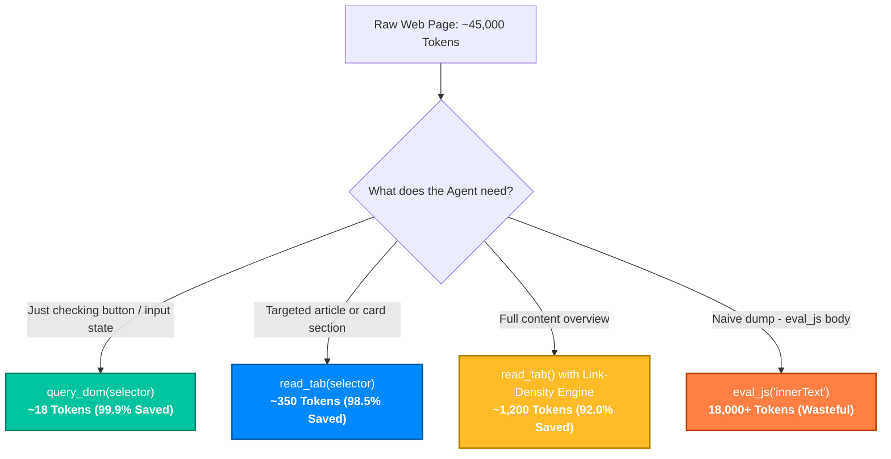
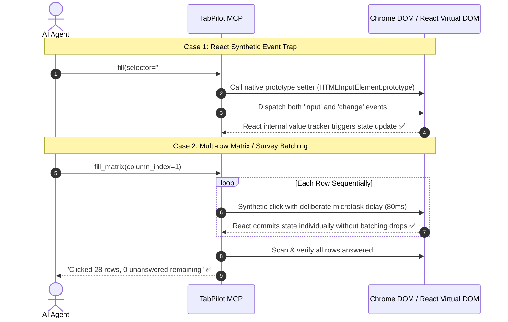
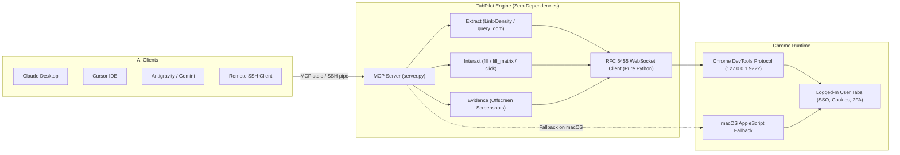
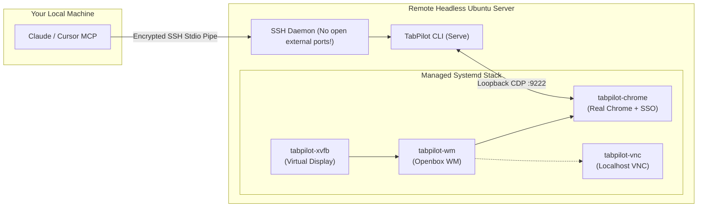

<p align="center">
  
</p>

# 🧭 TabPilot

<p align="center">
  <strong>The Missing Bridge for AI Browser Automation: Drive your <em>REAL</em>, Logged-in Chrome — with Zero Bot Detection, 90%+ Token Savings, and 24/7 Headless Capabilities.</strong>
</p>

<p align="center">
  <a href="https://github.com/hunglp97/tabpilot-mcp/actions/workflows/ci.yml"></a>
  <a href="https://modelcontextprotocol.io"></a>
  <a href="https://www.python.org"></a>
  <a href="https://github.com/hunglp97/tabpilot-mcp/blob/main/LICENSE"></a>
  <a href="https://github.com/hunglp97/tabpilot-mcp/stargazers"></a>
</p>

---

## ⚡ 10-Second TL;DR: What is TabPilot?

Most AI browser agents (Browser-Use, Playwright MCP, Puppeteer) make one fatal assumption: they launch a **fresh, blank browser profile**. That works for public search engines, but completely breaks on the tasks you actually care about:
- 🚫 **Cloudflare & Bot Shields** immediately block fresh automation browsers.
- 🚫 **Corporate SSO, Okta, & 2FA** make logging in automatically impossible or fragile.
- 🚫 **Read-only tab readers** (like AppleScript tools) can only *look* at the screen, not *act* on it.

**TabPilot bridges this divide.** It attaches directly to the **Google Chrome you already have open and logged into**. Your AI agents (Claude, Cursor, Antigravity, Cline) can read pages with up to **99.8% token savings**, click elements with authentic mouse events (`isTrusted: true`), bypass tricky React state caches, solve multi-row survey matrix grids, and capture background screenshots without interrupting your workflow.

```
+------------------------------------------------------------------------------------+
|  YOUR DESKTOP OR VPS              TABPILOT ENGINE               YOUR WORKFLOW      |
|                                                                                    |
|  [ Real Chrome Browser ] <=====> [ TabPilot MCP ] <===========> [ AI Agents ]     |
|   - Active Sessions               - Token Budgets                - Claude Desktop  |
|   - SSO & 2FA Bypassed            - Native Form Setters          - Cursor IDE      |
|   - Cookies & LocalStorage        - Matrix Grid Engine           - Antigravity     |
|   - Real Browser Fingerprint      - Dual CDP / AppleScript       - Windsurf / Cline|
+------------------------------------------------------------------------------------+
```

---

## 🚀 Quick Start (Zero Installation Needed)

### 1. Test your setup in one command
Run `tabpilot doctor` via `uvx` (no `pip install` required):

```bash
uvx --from git+https://github.com/hunglp97/tabpilot-mcp tabpilot doctor
```

### 2. Plug it into your MCP Client
Add this to your client config (`claude_desktop_config.json`, `.cursor/mcp.json`, etc.):

```json
{
  "mcpServers": {
    "tabpilot": {
      "command": "uvx",
      "args": ["--from", "git+https://github.com/hunglp97/tabpilot-mcp", "tabpilot-mcp"]
    }
  }
}
```

### 3. Launch Chrome with Debugging
Close all Chrome instances completely, then open your profile with remote debugging enabled:

```bash
# macOS
"/Applications/Google Chrome.app/Contents/MacOS/Google Chrome" \
  --remote-debugging-port=9222 --user-data-dir="$HOME/tabpilot-chrome"

# Linux
google-chrome --remote-debugging-port=9222 --user-data-dir="$HOME/tabpilot-chrome"

# Windows
taskkill /F /IM chrome.exe
"C:\Program Files\Google\Chrome\Application\chrome.exe" ^
  --remote-debugging-port=9222 --user-data-dir="%USERPROFILE%\tabpilot-chrome"
```
> *(On macOS without flags, TabPilot seamlessly falls back to AppleScript zero-config mode!)*

---

## 💰 How TabPilot Saves 90%+ Context Tokens

The default approach taken by naive browser MCPs is dumping `document.body.innerText` or raw HTML into the context window. This incinerates your LLM context budget on boilerplate: navbars, cookie banners, SVGs, and tracking scripts.

TabPilot features **Progressive Token Slicing**:



### Real-World Token Consumption Benchmark

| Method | Tokens Consumed | Context Waste | Best For |
| :--- | :---: | :---: | :--- |
| **`query_dom(selector)`** | **~15 – 30** | **0.1%** | Verifying if submit button is disabled, reading error alerts, checking checkbox states |
| **`read_tab(selector)`** | **~300 – 600** | **1.8%** | Reading bug descriptions, comments, or isolated forum threads |
| **`read_tab()`** *(Link-Density Engine)* | **~1,200 – 2,000** | **7.5%** | Reading full pages without nav, ads, headers, footers |
| ❌ *Traditional `eval_js` innerText* | ~15,000 – 25,000 | 100% | *Context budget incinerator* |
| ❌ *Raw HTML DOM dump* | 40,000 – 80,000+ | 300%+ | *Causes model hallucinations & limits* |

> 💡 **Built-in Budget Cap:** TabPilot actively enforces `--max-chars 20000` (configurable). If a read truncates, it explicitly returns `[Truncated at 20000 of 64000 chars - refine with selector]` so your agent can zoom in with zero guessing!

---

## 🥊 The Real-World Driving Advantage

Modern Web Applications (React, Vue, Angular, Svelte) are deliberately designed in ways that defeat traditional automation scripts. TabPilot solves the 3 most infamous failure modes:



### 1. The React Synthetic Event Trap
* **The Problem:** Setting `input.value = 'hello'` updates the DOM property, but React caches the previous value. React sees no change, refuses to trigger state hooks, and form submission fails silently!
* **TabPilot's Solution:** TabPilot accesses the native descriptor (`Object.getOwnPropertyDescriptor(HTMLInputElement.prototype, 'value').set`), applies the value, and dispatches native `input` + `change` events.

### 2. Multi-row Matrix & Grid Surveys
* **The Problem:** In survey tools (Qualtrics, Toluna, SurveyMonkey, Google Forms), clicking 20 radio buttons in a loop causes React to batch state updates, registering only the final click and leaving 19 rows blank.
* **TabPilot's Solution:** `fill_matrix` clicks row-by-row across separate event loop ticks with a configurable delay (`--matrix-delay-ms 80`), then re-scans the DOM to prove all rows are answered.

### 3. Virtual & Floating Dropdowns (React-Select, Headless UI, Radix)
* **The Problem:** There is no `<select>` element in the DOM. Options only exist when the trigger is clicked and the menu portal mounts.
* **TabPilot's Solution:** `select_option_ui` clicks the custom control, waits for the popper/portal element to render, and safely clicks the target option text.

### 4. Background & Off-Screen Tab Screenshots
* Can take full-height scrolling screenshots (`full_page=True`) or element-focused snaps (`selector=".receipt"`) on tabs **running in the background**, without stealing window focus from your work.

---

## ⚖️ Feature Comparison Matrix

| Feature | Browser-Use / Playwright | Read-Only Tab Readers | 🧭 **TabPilot** |
| :--- | :---: | :---: | :---: |
| **Logged-in Sessions (SSO / 2FA / Cookies)** | ❌ New incognito profile | ✅ Real Chrome | ✅ **Real Chrome (Zero re-login)** |
| **Bypasses Cloudflare / Bot Shields** | ❌ Fingerprinted as bot | ✅ Human fingerprint | ✅ **Human browser fingerprint** |
| **Interactive Form Driving & Clicking** | ✅ Yes | ❌ Read-only | ✅ **Full bidirectional control** |
| **React Synthetic Event Fix** | ⚠️ Often fails | ❌ N/A | ✅ **Native prototype setters** |
| **Matrix Survey Handler** | ❌ Batched click drops | ❌ N/A | ✅ **`fill_matrix` task scheduling** |
| **Token-Optimized DOM Inspection** | ❌ Raw DOM / Vision | ⚠️ Basic text | ✅ **`query_dom` (18 tokens)** |
| **Background Tab Screenshots** | ✅ | ❌ Must be active | ✅ **Off-screen CDP captures** |
| **Headless Ubuntu 24/7 Daemon** | ⚠️ Complex Docker | ❌ macOS only | ✅ **Native systemd stack** |
| **External Dependencies** | ❌ Node.js, Chromium bins | ❌ macOS osascript | ✅ **Zero deps beyond MCP SDK** |
| **Fallback on Non-Configured macOS** | ❌ Crashes | ✅ | ✅ **Auto-falls back to AppleScript** |

---

## 🏗️ Technical Architecture

TabPilot avoids bulky frameworks. It talks directly to Chrome via a custom-built RFC 6455 WebSocket client implemented purely using Python `socket` from the standard library:



---

## 🐧 24/7 Headless Ubuntu Server Deployment

TabPilot is built from the ground up to run on cloud VPS instances (AWS, Hetzner, DigitalOcean) as a permanent 24/7 headless browser daemon:



### Why this setup is rock-solid:
1. **One-Command Setup:** `bash deploy/ubuntu/install.sh` configures Xvfb, Openbox, Chrome, and systemd units with `Restart=always`.
2. **Font Protection (Anti-Tofu):** Headless Ubuntu usually renders Vietnamese, Japanese, and Chinese characters as blank rectangles ("tofu boxes"). `install.sh` installs Noto and Liberation fonts, and `doctor` verifies font rendering.
3. **Cgroup Memory Caps:** Prevent Chrome from crashing your host:
   ```bash
   tabpilot install-stack --memory-high 4G
   ```
4. **Zero Open Ports:** Chrome listens strictly on `127.0.0.1`. Remote MCP connections run securely through SSH pipes (`ssh you@server "tabpilot serve"`).

---

## 🧰 Full Tools & Resources Reference

TabPilot provides **17 specialized tools** and **2 live resources**:

### 1. 📖 Reading & Inspection Tools
| Tool Name | Key Parameters | Token Impact | Purpose |
| :--- | :--- | :---: | :--- |
| `query_dom` | `selector`, `attrs`, `visible_only` | **~18 tokens** | Atomic inspection of buttons, form states (`disabled`, `checked`), and labels. |
| `read_tab` | `selector`, `mode`, `max_chars`, `url_pattern` | **~350–1200** | Extracts clean markdown using link-density algorithms. Strips nav/footers. |
| `list_tabs` | `url_pattern` | Low | Lists all open tabs with IDs, titles, and URLs. |
| `eval_js` | `expression`, `timeout_ms` | Variable | Runs arbitrary JS in tab; automatically awaits Promises in CDP. |

### 2. 🧭 Navigation & Tab Management
| Tool Name | Key Parameters | Purpose |
| :--- | :--- | :--- |
| `open_tab` | `url`, `activate`, `wait_for_load` | Opens URL in a new tab, awaiting complete page rendering. |
| `close_tab` | `url_pattern`, `tab_id` | Closes tab and polls until the process confirms destruction. |
| `navigate` | `url`, `wait_for_load` | Points existing tab to a new URL. |
| `activate_tab` | `url_pattern`, `tab_id` | Brings target tab into foreground focus. |

### 3. 🖱️ Interaction & Complex Form Driving
| Tool Name | Key Parameters | Purpose |
| :--- | :--- | :--- |
| `click` | `selector`, `text`, `nth` | Scrolls element into viewport and fires authentic `isTrusted: true` mouse clicks. |
| `fill` | `selector`, `value`, `press_enter` | Bypasses React state cache by calling native prototype setter. |
| `select_option` | `selector`, `values`, `by` | Selects items in standard HTML `<select>` or Select2 widgets. |
| `select_option_ui` | `control_selector`, `option_text` | Clicks trigger, waits for popup portal, and chooses React-Select / Headless UI items. |
| `wait_for` | `selector`, `state`, `text`, `timeout_ms`| Polls for element state (`visible`, `hidden`, `text`, `enabled`). |

### 4. 📊 Matrix Surveys & Evidence
| Tool Name | Key Parameters | Purpose |
| :--- | :--- | :--- |
| `scan_matrix` | `selector` | Discovers multi-row grid questions and flags unanswered items. |
| `fill_matrix` | `column_index`, `rows`, `delay_ms` | Answers grids row-by-row with microtask delays to defeat React batching. |
| `screenshot` | `full_page`, `selector`, `label` | Offscreen capture of any tab (local file path or inline base64 image). |
| `browser_status` | *None* | Reports backend status, capabilities, and open tabs count. |

### 📦 Live MCP Resources
* `tab://active` — Real-time markdown stream of the active tab.
* `tab://{tab_id}` — Real-time markdown stream of any specific tab.

---

## 🎯 Real-World Scenarios

### Scenario 1: Automated QA Bug Reporting on Test IO / Jira
> **Agent Prompt:** *"Open the active bug submission tab on Test IO, fill in the issue title, select severity as 'Critical' using the custom dropdown, and attach a screenshot."*
* TabPilot resolves the tab via `url_pattern=r"tester\.test\.io/tests/\w+/bugs"` without guessing tab IDs.
* Fills input fields cleanly through React setters.
* Uses `select_option_ui` to handle the floating custom dropdown.
* Captures a full-page screenshot and returns the file path.

### Scenario 2: 30-Row Matrix Survey Auto-Completion
> **Agent Prompt:** *"Fill the rating grid question on the current page, choosing column 2 for all questions."*
* Standard agents click 30 buttons instantly; React commits only the last one.
* TabPilot's `fill_matrix(column_index=1)` scans the 30 rows, clicks them with 80ms delays, re-scans the DOM, and reports `clicked: 30 | still unanswered: 0`.

### Scenario 3: Investigating Dashboards Behind Okta SSO
> **Agent Prompt:** *"Check our AWS CloudWatch dashboard to see if error rate spiked in the last 15 minutes."*
* No credentials or API keys needed: your Chrome session is already authenticated.
* The agent reads the dashboard table using `read_tab(selector="#metrics-table")` in only ~400 tokens!

---

## 🩺 The `tabpilot doctor` Diagnostic

Never wonder why automation failed. Run `tabpilot doctor`:

```text
TabPilot doctor

Environment
  ✓ platform: Darwin 25.6.0 (arm64)
  ✓ python: 3.14.3

Chrome
  ✓ chrome binary: /Applications/Google Chrome.app/Contents/MacOS/Google Chrome
  ✓ chrome version: Google Chrome 152.0.7977.83

Transport
  ✓ cdp 127.0.0.1:9222: Chrome/152.0.7977.83

Browser
  ✓ backend selected: cdp (capabilities: activate, eval, navigate, open_close, screenshot, trusted_input)
  ✓ tabs: 2 open
  ✓ javascript round-trip: 1 + 1 returned 2

Evidence
  ✓ screenshot dir: /Users/username/.tabpilot/screenshots

All systems operational.
```

If something is misconfigured, `doctor` gives you the exact command to copy-paste and fix it!

---

## 🛠️ CLI Reference

```bash
tabpilot doctor                # Diagnose environment, Chrome, fonts, and CDP ports
tabpilot tabs                  # List open tabs directly in terminal
tabpilot serve                 # Run MCP server on stdio

# Linux Headless Stack Commands
tabpilot install-stack         # Install systemd user services
tabpilot up                    # Start headless Xvfb + Openbox + Chrome
tabpilot down                  # Stop the headless stack
tabpilot status                # Check systemd status
tabpilot logs chrome -f        # Tail Chrome's stdout/stderr
```

---

## 🧪 Development & Testing

```bash
git clone https://github.com/hunglp97/tabpilot-mcp.git
cd tabpilot-mcp
python3 -m venv .venv
source .venv/bin/activate
pip install -e ".[dev]"

# Run pure unit tests (zero browser requirement)
pytest -v

# Run live CDP integration tests
pytest -v -m live
```

---

## 🤝 Contributing

We welcome contributions! Whether adding WebDriver BiDi support, optimizing JavaScript extraction heuristics, or writing integrations:

1. Fork the project.
2. Create your branch: `git checkout -b feat/my-improvement`.
3. Verify test coverage: `pytest`.
4. Submit a Pull Request.

---

## 📄 License

Distributed under the **MIT License**. See [LICENSE](LICENSE) for details.

---

<p align="center">
  Built with ❤️ for AI Engineers, QA Automators, and Power Users who demand real browser agency.
  <br>
  <strong>Star ⭐ TabPilot on GitHub if it saved your agents from bot shields and token burn!</strong>
</p>
