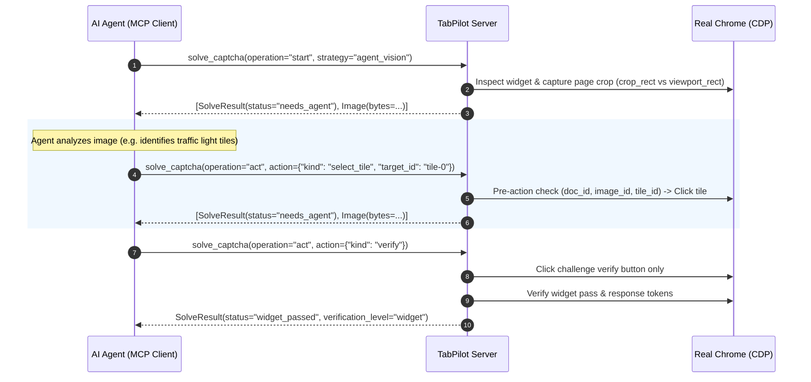

# 🛡️ CAPTCHA Handling in TabPilot

TabPilot provides transparent, verifiable, browser-native CAPTCHA handling designed specifically for AI coding and automation agents (Claude Desktop, Cursor, Antigravity, Cline).

Unlike third-party scraping libraries that rely on paid solve farms, token injection, or fingerprint spoofing, TabPilot operates within the **real, user-authenticated browser** via the Chrome DevTools Protocol (CDP). It provides tools for passive resolution, automated checkbox interaction, and interactive agent-vision observation-action loops.

---

## 🧰 Tools Architecture

TabPilot exposes **19 core tools** over MCP stdio:
- 17 general browser tools: `browser_status`, `list_tabs`, `open_tab`, `close_tab`, `navigate`, `activate_tab`, `read_tab`, `query_dom`, `eval_js`, `click`, `fill`, `select_option`, `select_option_ui`, `scan_matrix`, `fill_matrix`, `wait_for`, `screenshot`.
- **2 dedicated CAPTCHA tools**: `detect_captcha` and `solve_captcha`.

### 1. `detect_captcha`
- **Purpose**: Zero-side-effect, non-destructive inspection of the active document. Frame references are discovered and routed via CDP subtarget sessions.
- **Output**: Returns a structured list of `candidates`, each containing:
  - `candidate_id`: Deterministic unique identifier (e.g., `cf_0`, `recaptcha_1`).
  - `provider`: `cloudflare`, `recaptcha`, `hcaptcha`, `custom`.
  - `challenge_kind`: `checkbox`, `interstitial`, `image_grid`, `image_select`, `image_text`, `slider`.
  - `confidence`: `high`, `medium`, `low`.
  - `signals`: Array of detected DOM and iframe signals.
  - `available_strategies`: List of viable solver strategies (e.g. `["checkbox", "agent_vision"]`).
  - `frame_ref`, `widget_ref`, `rect_css`: Precise DOM and frame references.

### 2. `solve_captcha`
- **Purpose**: Stateful, multi-round challenge orchestrator.
- **Operations**:
  - `start`: Initiates a solve session, binds lease to tab/candidate, captures baseline token fingerprints, and attempts automated or initial vision observation.
  - `observe`: Retrieves the latest challenge observation, screenshot, and layout without executing any mutation or click.
  - `act`: Executes a targeted solver action (`select_tile`, `click_point`, `drag`, `type_answer`, `verify`, `refresh`) with atomic deduplication.
  - `cancel`: Aborts the solve session, releasing tab locks and leases.

---

## 🔄 The Agent-Vision Interaction Loop

When an interactive visual challenge occurs (e.g., tile grid selection, slider puzzle, alphanumeric captcha), TabPilot engages the **Agent-Vision Loop**:

### Action Types (`ActionKind`)
- `select_tile`: Click a specific grid tile by ID (must match an observed tile in `obs.tiles`).
- `click_point`: Click normalized coordinates `{"x": [0,1], "y": [0,1]}` within challenge viewport. Requires `image_id`.
- `drag`: Perform an authentic drag gesture from `point` to `drag_to`. Requires `image_id`.
- `type_answer`: Fill an alphanumeric text code into the challenge's input field.
- `verify`: Click the challenge's verify/submit button (strictly scoped to the challenge container; never clicks the business form submit button).
- `refresh`: Request a new challenge image from the provider widget.

---

## 🔒 Safety Invariants & Reliability Guarantees

TabPilot enforces 11 core reliability invariants (validated in `tests/test_captcha_regressions.py` and `docs/verification/captcha/2026-09-28-review/recheck.py`):

1. **Strict Control & Action Scoping (F01, N06)**: All actions (`select_tile`, `refresh`, `verify`, `click_point`) are strictly scoped to the candidate challenge widget and container hierarchy. Synthetic observation IDs (`tile-0`) and reload controls (`#recaptcha-reload-button`, `.reload-btn`, `.refresh-btn`) are never queried document-wide, preventing clicks on unrelated page buttons or forms.
2. **Widget-Scoped Pass Verification (F02, N04, N05)**: Pass detection verifies fresh response tokens or state markers belonging exclusively to the candidate widget container. Sibling pass markers in the same form (e.g., adjacent `.captcha-box`) or checked checkboxes (e.g., newsletter opt-ins) never produce false passes. Interstitials disappearing into error screens (403, 503) are never declared passed without positive verification of destination access postconditions.
3. **Pre-Action Staleness & Content Fingerprinting (F03, F06, N03)**: Before dispatching input, TabPilot validates document lifecycle ID (`window.__tabpilot_doc_id`), widget presence, prompt text, and challenge content fingerprints (canvas data URLs, image sources, tile styles/classes/backgrounds). If challenge visual contents change between rounds despite identical prompts, the action is rejected fail-closed with `status="stale_observation"` before any side effects are dispatched.
4. **Guaranteed Image Delivery (F04)**: For `status="needs_agent"`, TabPilot always returns inline image bytes over MCP stdio, regardless of whether `return_images` is configured to `auto`.
5. **OOPIF Discovery, Distinct Identity & Frame-Aware Routing (F05, N01, N02)**: Discovers cross-origin and OOPIF iframe challenges via frame traversal without URL-based coalescing (preserving independent identity for multiple iframes with identical URLs). Binds candidate contexts to owning frames and routes layout inspection, screenshot cropping with iframe offsets, input dispatch, and pass verification directly to the owning frame.
6. **Atomic Action Deduplication (F07)**: Concurrent requests with identical `action_id` are synchronized via in-flight event locks. Exactly one thread executes the browser action; retries of unknown or failed actions do not replay unverified side effects.
7. **Resumable Active Solve (F08)**: Repeated `start` operations for an active solve candidate return the existing active solve session without re-clicking anchors or duplicating state.
8. **JSON-Encoded Access Verification (F09)**: Postcondition predicates (`visible_selector`, `text_contains`, `url_regex`) are safely serialized with JSON encoding, avoiding `ReferenceError: None is not defined`.
9. **Hard Monotonic Deadline Enforcement & Pre-Input Checks (F10, N07)**: Remaining deadline budgets are propagated through detection, layout inspection, and DOM prechecks. Budget limits are re-verified immediately before dispatching any browser input (`click_at`, `drag`, `insert_text`), ensuring zero browser side-effects occur after deadline expiration.
10. **Error Preservation (F11)**: JSError or transport failures during inspection return `status="unverified"` with inspection failure evidence rather than falsely claiming `no_captcha`.

---

## 📊 Provider & Qualification Status

| Provider / Kind | Strategy | Qualification Level | Test Coverage |
|---|---|---|---|
| **Turnstile (Simulation)** | `checkbox`, `passive_wait` | **Fully Verified (Local Fixture)** | `tests/test_live_captcha.py::test_live_solve_turnstile_checkbox` |
| **reCAPTCHA v2 (Simulation)** | `checkbox`, `passive_wait` | **Fully Verified (Local Fixture)** | `tests/test_live_captcha.py::test_live_solve_recaptcha_checkbox` |
| **Grid Challenge (Simulation)** | `agent_vision` | **Fully Verified (Local Fixture)** | `tests/test_live_captcha.py::test_live_solve_image_grid_challenge` |
| **Text CAPTCHA (Simulation)** | `agent_vision` (`type_answer`, `verify`) | **Fully Verified (Local Fixture)** | `tests/test_live_captcha.py::test_live_solve_text_captcha` |
| **Slider Puzzle (Simulation)** | `agent_vision` (`drag`) | **Fully Verified (Local Fixture)** | `tests/test_live_captcha.py::test_live_solve_slider_puzzle` |
| **Cloudflare Interstitial (Simulation)** | `passive_wait` | **Verified (Regression Suite)** | `tests/test_captcha_regressions.py` & `docs/verification/captcha/2026-09-28-review/recheck.py` |
| **Real Provider Live Pages** | `checkbox`, `agent_vision` | **Experimental** | Subject to provider network availability and test key provisioning |
| **OCR / Audio / CV Solvers** | `image_ocr`, `recaptcha_audio`, `slider_cv` | **Planned (P4)** | Extra dependency placeholders; raises `NotImplementedError` in base install |

> [!NOTE]
> TabPilot base install has **zero mandatory machine learning dependencies** (pure Python + MCP SDK). Standalone OCR, Audio transcription, and OpenCV template matching are reserved for optional P4 extensions.

---

## 🛡️ Best Practices for AI Agents

1. **Always run `detect_captcha` first**: Before attempting form interactions or logins, inspect the tab for active CAPTCHA candidates.
2. **Check `candidate.available_strategies`**: Prefer `checkbox` or `passive_wait` for Turnstile/reCAPTCHA anchors; switch to `agent_vision` if the anchor presents a secondary interactive challenge.
3. **Follow the observation ID**: When calling `act`, always pass the current `observation_id` returned by the previous step to guarantee coordinate and state synchronization.
4. **Define `expected` access conditions**: Provide postcondition assertions such as `expected={"visible_selector": "#dashboard"}` to automatically verify login success after solving.
